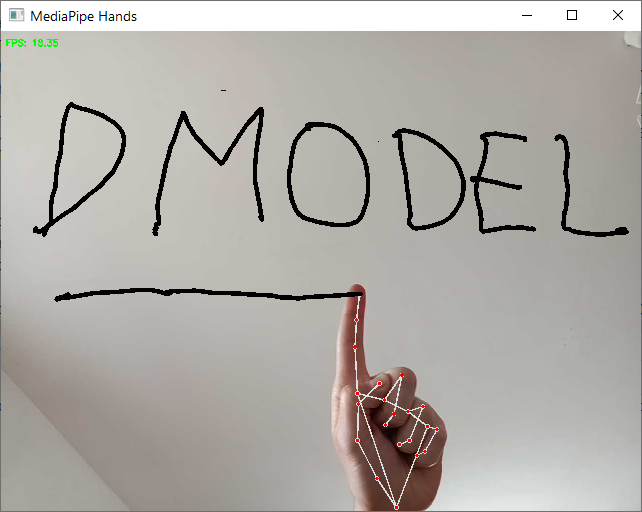
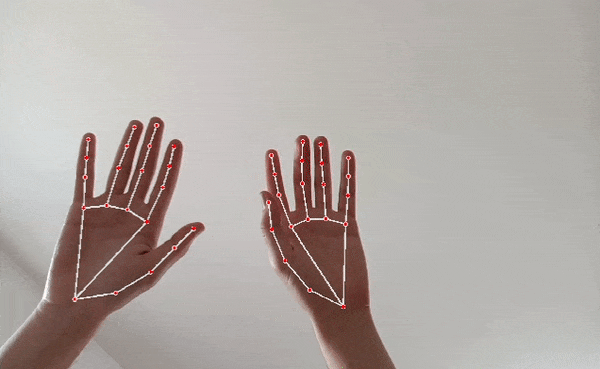
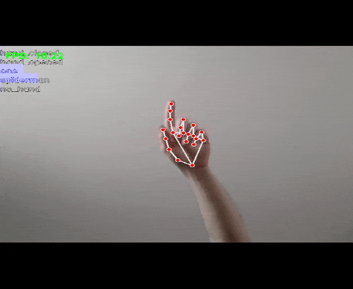
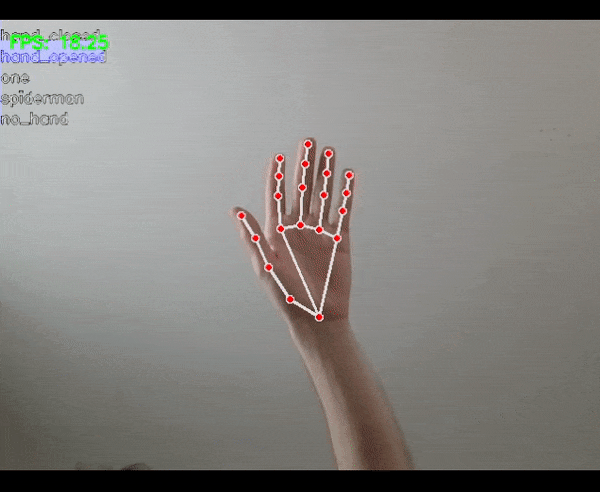

# A virtual whiteboard with hand gestures recognition

This project is an implementation of a virtual whiteboard using hand gestures recognition. The project is based on the MediaPipe library and is entirely written in Python.
You write with the right hand, using the "one" gesture, and you can erase with the left hand, using an open hand.

## Folders structure

The project is structured as follows:

`gesture_recognition` contains:
- The dataset for the training of the model created using `make_dateset.py`;
- Different models trained for the hand gesture recognition, created using `train_model.py`:
  - `rino` containing notes about some machine learning models and how to use them;
  - `paolo` containing some scikit-learn models, included the final one used in the project (SVM);
  - `test_gesture_HMM.py` implementing a Hidden Markov Model Filtering for the gesture recognition;
- `test_camera.py` for testing camera and openCV;
- `recycle_bin` containing some old files;
- `images` containing some images used in this README;
- `virtual_board_filtered.py` for the implementation of the virtual whiteboard without any filtering et with basic gesture recognition;
- `virtual_board_filtered.py` for the implementation of the virtual whiteboard with HMM and Kalman filtering and trained model for gesture recognition;
- `demo_kalman.py` implementing a Kalman filter on finger position;
- `requirements.txt` for installing the required libraries with pip.

## Gesture recognition

The MediaPipe library allows for hand detection and tracking, but not for gesture recognition. Therefore, we decided to create our own gesture recognition model, which is essential if we want to associate specific instructions with different gestures.

Initially, we only used the ratio between variance of finger tip and base positions to distinguish between an open and closed hand, but eventually we decided to implement a proper gesture recognition system.

We opted for a fairly simple approach that turned out to be quite effective: we implemented a script (make_dataset.py) to generate landmark datasets by simply recording the output of MediaPipe while we performed a gesture in front of the camera for a couple of minutes, moving our hand to change its position and orientation. In total, four gestures were performed: open hand, closed hand, one, and "Spiderman" (index and pinky fingers extended, middle and ring fingers folded, thumb tucked in).

Two training and testing datasets (included in the repository) were recorded in two separate sessions using different cameras. Unfortunately, all of the gestures in the dataset were performed by the same subject.

The landmarks were then preprocessed to normalize them in terms of position, size, and angle, before testing various ML algorithms to find an effective and fast enough model that would not affect the framerate. The SVM proved to be an optimal choice for the task.

## Bayesian Filtering (HMM and Kalman)

The result was a virtual whiteboard that worked quite well, but occasionally had some stuttering due to small errors in landmark or gesture recognition.

To make the result smoother (but mostly because we were curious to test this approach), we implemented two Bayesian filters:

- An HMM filtering (([here](https://itsadeepizza.github.io/2023-03-12-hmm_filtering/) is the post we wrote on the topic) for gesture recognition;
- A Kalman filter for the position of the index finger (which represents the tip of our virtual pen).

**Plain model**:

**With HMM Filtering**:

## Usage recommendations
This repository, like our other projects, has a more educational than practical purpose, and our goal was not to produce an implementation of a ready-to-use virtual whiteboard.

Nevertheless, our code is perfectly operational, and you can test our virtual whiteboard for yourself. You can use the webcam of your computer or use your phone as an IP webcam, which usually provides access to a higher quality camera. Please note that depending on your computer's specifications, a too high resolution may significantly reduce the framerate.

We noticed a significant difference in the performance of MediaPipe, and therefore of the virtual whiteboard, depending on the lighting conditions: try to prefer a well-lit environment.

If you want to go further, you could consider:

- modifying the graphics parameters (thickness, color, etc.);
- modifying the transition matrix or other parameters of the filters;
- creating your own gesture recognition model or your own dataset, starting from the tools provided.
For any questions, you can contact us on our [Discord](https://discord.gg/VXEH5weceY) server or visit our [website](https://itsadeepizza.github.io/).

